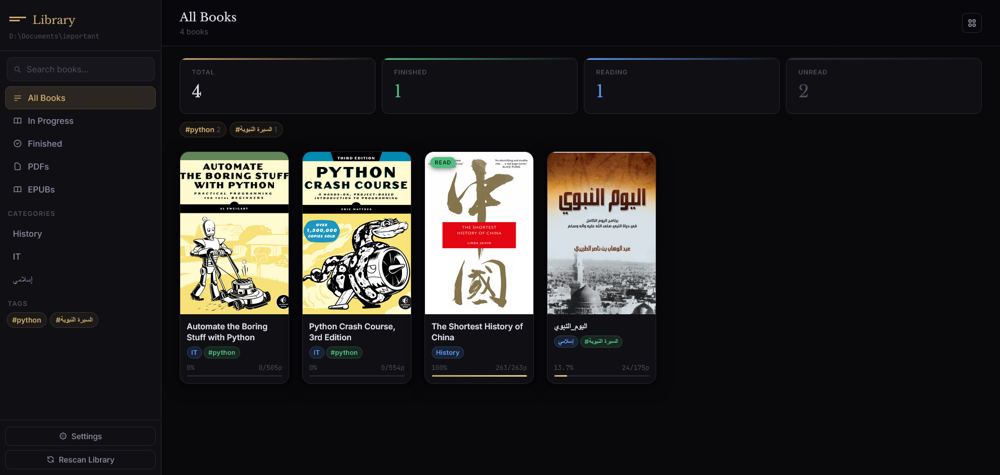
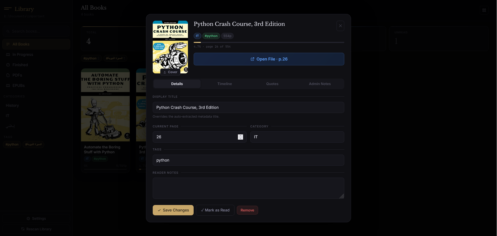

# Shelfie - Local Library Manager

[](https://pypi.org/project/shelfie-py/) [](https://hub.docker.com/r/mhmdsamerdev/shelfie)

**Shelfie** is a fast, self-hosted web application for managing your personal library of PDFs and EPUBs.
Designed with simplicity in mind, Shelfie automatically watches your book folder for new files, generates covers, and provides a clean, responsive web interface to browse and search your collection.

## Screenshots




## Installation

### Pip
The stable releases of _shelfie_ are distributed on [PyPI](https://pypi.org/) and can be easily installed or upgraded using [pip](https://pip.pypa.io/en/stable/):
```
pip install shelfie-py
shelfie
```
### Docker
```
git clone https://github.com/mhmdsamer-dev/shelfie.git
cd shelfie/
docker build -t shelfie .
BOOKS_DIR=REPLACE/YOUR/BOOK/PATH docker compose up -d
```

Pulling image from [Docker Hub](https://hub.docker.com/r/mhmdsamerdev/shelfie):
```
docker run -d -p 8000:8000 -e LIBRARY_PATH=/books -v shelfie_data:/data -v "D:\Your\Books\Folder":/books:ro mhmdsamerdev/shelfie
```

## CLI options

```
shelfie [--host HOST] [--port PORT] [--reload] [--log-level LEVEL]
  --host       Bind address (default: 127.0.0.1)
  --port       Port number  (default: 8000)
  --reload     Auto-reload on code changes (development)
  --log-level  debug | info | warning | error  (default: info)
```

### Update checks

On startup, Shelfie checks PyPI for a newer `shelfie-py` release and prints an upgrade hint:

- Pip installs: `pip install --upgrade shelfie-py`
- Docker installs: `docker pull mhmdsamerdev/shelfie`

Disable this check by setting `SHELFIE_DISABLE_UPDATE_CHECK=1`.

All user data is stored under `SHELFIE_DATA_DIR` (default `~/.shelfie`)

## 🤝 Contributing

Please open an issue first to discuss what you would like to change.